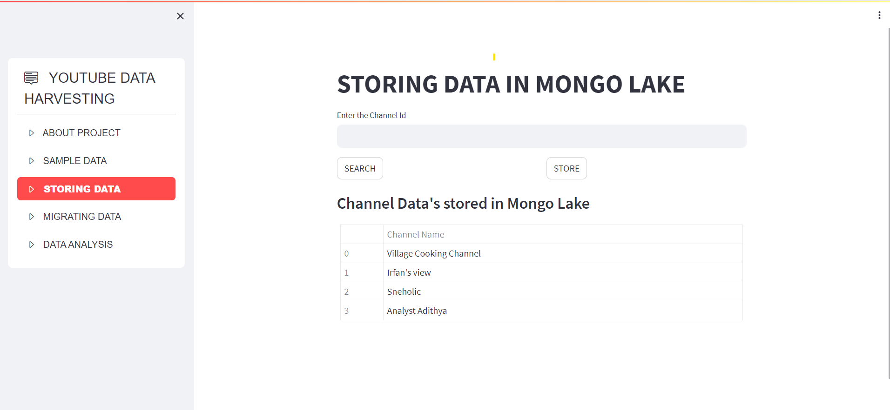

# YouTube-Data-Harvesting-and-Warehousing-using-SQL-MongoDB-and-Streamlit

 This application designed to facilitate the exploration and in-depth analysis of data from multiple YouTube channels. The app leverages the Google API to retrieve essential channel information, video statistics, and user engagement metrics. With features ranging from data storage in MongoDB to SQL database migration, this app provides a comprehensive platform for deriving insights and making informed decisions.

## Features

1. **Data Retrieval**: Input a YouTube channel ID to retrieve channel details, video statistics, and user engagement metrics via the Google API.
2. **MongoDB Data Lake**: Store collected data in a MongoDB database for future reference and analysis.
3. **Multi-Channel Collection**: Effortlessly gather data from up to 10 YouTube channels by simply clicking a button.
4. **SQL Database Migration**: Seamlessly migrate data from the MongoDB data lake to a structured SQL database for efficient organization and analysis.
5. **Advanced Search**: Utilize SQL database capabilities to conduct advanced searches, including table joins, for comprehensive insights.

## Getting Started

1. Clone this repository to your local machine.
2. Install the required dependencies using the below command.
```bash
pip install google-api-python-client
pip install isodate
pip install streamlit
pip install pandas
pip install streamlit-option-menu
pip install mysql-connector-python
pip install pymongo
```
3. Set up your [Google API credentials](https://support.google.com/googleapi/answer/6158862?hl=en) and enable the **YOUTUBE DATA API V3** service for YouTube data retrieval.
4. Replace the API key in **data_scrapper.py** file with the generated API Key. 
5. Configure the MYSQL connection by replacing the existing password in **migrate_sql.py** file with your MYSQL password. 
6. Run the Streamlit app using the below command.
   
```bash
streamlit run main.py
```

## Usage
1. Input a YouTube channel ID in the app interface to retrieve relevant data.
2. Click the **STORE** button to gather information from selected channels and store it in the MongoDB data lake.
3. Choose a channel to migrate its data from the data lake to the SQL database.
4. Leverage the advanced search options to extract comprehensive insights from the SQL database.

## Contributions
Contributions to this project are welcome! If you encounter any issues or have suggestions for improvements, feel free to submit a pull request.

## Contact
For inquiries or support, please contact balajigurusamy99@gmail.com or 
[LINKEDIN](https://www.linkedin.com/in/balajiguru/)

